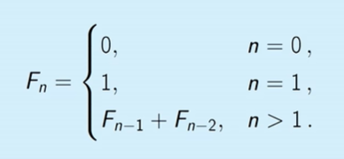

# Algorithmic Warm-up

## Fibonacci numbers
### Problem Overview
+ Learning objects:
    - Understand the definition of the Fibonacci numbers.
    - Show that Fibonacci numbers become very large.



+ Example: developed to study rabbit populations model.

### Naive Algorithm
+ Pseudocode:
    ```
    void FibRecurs(n):
        if n <= 1:
            return n;
        else:
            return FibRecurs(n - 1) + FibRecurs(n - 2)
    ```
+ Running time:
    - T(n): the number of lines of code executed by FibRecurs()
        - if n <= 1: T(n) = 2
        - else: T(n) = T(n-1) + T(n - 2) + 3
    - Recursive takes a lot of time.

### Efficient Algorithm
+ Pseudocode:
    ```
    // Create an array F[0, ..., n]
    F[0] <- 0
    F[1] <- 1
    for i from 2 -> n:
        F[i] := F[i-1] + F[i-2]
    return F[n]
    ```

+ Running time: 
    - T(n): the number of lines of code
        - T(n) = 2*n + 2

## Greatest common divisor
+ Problem:
    - Compute GCD:
        - Input: integers a, b >= 0
        - Output: gcd(a, b)

### Naive algorithm
+ Pseudocode:
```
NaiveGCD(a, b)
    best := 0
    for d := 1 to a + b:
        if d/a and d/b:
            best := d
    return best
```
+ Running time: 
    - T(n): a + b

### Efficient Algorithm
+ Key lemma:
    - let a' be the remainder when a is divided by b:
    ```
        gcd(a, b) = gcd(a', b) = gcd(a, b')
    ```

+ Proof: 
    - a = a' + b*q
    - d divides a & b (~ (a' % d==0) & (b % d==0)) if and if only:
        - d divides a' & b.

+ Euclidean Algorithm:
```
EuclideanGCD(a, b):
    if b == 0:
        return a
    a' = a/b # a' = a - int(a/b)*b
    return EuclideanGCD(b, a')
```

+ Example:
    - gcd(15, 10) -> gcd(10, 5) -> gcd(5, 0) => gcd_value = 5
    - gcd(10, 15) -> gcd(15, 10) -> ... => gcd_value = 5

+ Running time: 
    - Takes about *log(ab)* steps

## Big-O notation
+ Learning objects:
    - Describe some of the issue involved with computing the runtime of an actual program.
    - Understand why finding exact run-times is a problem.

### Computing Run-times
#### Revisit Fibonacci 
+ Run-time analysis:
```
FibList(n):
    // create an array F[0, ..., n]
    F[0] := 0   # line 1: Assignment
    F[1] := 1   # line 2: Assignment
    for i := 2 -> n: # line 3: increment, comparison & branch
        F[i] := F[i - 1] + F[i - 2] # line 4: lookup, assignment, addition of big integers
    return F[n] # line 5
```

### Asymptotic (approximate) notation

+ Computing run-times hard:
    - Depend on fine details of program.
    - Depend on details of computer.

+ Idea: All of these issues can multiply run-times by (large) constant. *So measure runtime in a way that ignores constant multiples.*

+ Problem: Unfortunately, 1s, 1 hour ... only differ by constant multiples.

+ Solution: Consider **asymptotic** runtimes. How does runtime **scale** with input size.

+ log(n) < sqrt(n) < n < n*log(n) < n**2 < 2**n

## Big-O notation
### Definition:
+ f(n) = O(g(n)) (f is big-O of g) or f $\preceq$ if there exist constants N and c so that for all n >= N, f(n) <= c.g(n).

### Growth rate


## Using Big-O
+ We will use big-O notation to report algorithm run-times. This has several advantages.
    - Clarifies growth rate
    - Cleans up notation
+ Warning:
    - Using Big-O loses important information about constant multiples
    - Just **asymptotic**

+ Common rules:
    - Multiplicative constants can be omitted. Ex: 7.n^3 = O(n^3)
    - $n^{a} \preceq n^{b}$ for 0 < a < b. Ex: n = O(n^2) -> n^(1/2) = O(n)
    - $n^{a} \preceq b^{n} (a > 0, b > 1)$. Ex: n^5 = O(1.1^n)
    - $log(n)^{a} \preceq n^{b} (a, b > 0)$. Ex: (log(n))^3 = O(n^0.5)
    - Smaller terms can be omitted. Ex: n^2 + n = O(n^2)

+ Recall Fibonacci problem:

| Operation  | Run time  |
|---|---|
| Create an array F[0, ..., n]  | O(n)  |
| F[0] := 0  |  O(1) |
| F[0] := 0  |  O(1) |
| for i:= 2 to n:  | loops O(n)  |
|   F[i]:= F[i - 1] + F[i - 2]  | O(n)  |
| return F[n]  | O(1)  |
|  Total  |  O(n^2) |

+ Other notation:
- Definition:
