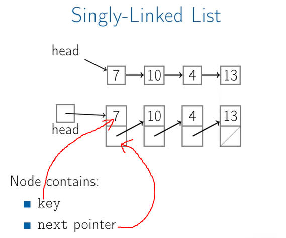

# Basic Data Structures

# Contents
- [Basic Data Structures](#basic-data-structures)
- [Contents](#contents)
  - [1. Arrays and Linked Lists](#1-arrays-and-linked-lists)
    - [1.1 Arrays](#11-arrays)
    - [1.2 Singly-Linked lists](#12-singly-linked-lists)
      - [Push front](#push-front)
      - [PopFront](#popfront)
      - [PushBack(Key)](#pushbackkey)
      - [PopBack()](#popback)
      - [AddAfter(node, key)](#addafternode-key)
      - [Summary](#summary)
    - [1.3 Doubly-Linked lists](#13-doubly-linked-lists)
      - [PushBack(key)](#pushbackkey-1)
      - [PopBack()](#popback-1)
      - [AddAfter(node, key)](#addafternode-key-1)
      - [Summary](#summary-1)
  - [2. Stack and Queues](#2-stack-and-queues)
    - [2.1 Stack](#21-stack)
      - [IsBalanced(str)](#isbalancedstr)
      - [Stack implement with array](#stack-implement-with-array)
      - [Stack implement with Linked List](#stack-implement-with-linked-list)
      - [Summary](#summary-2)
    - [2.2 Queues](#22-queues)
  - [3. Trees](#3-trees)
    - [3.2 Tree Traversal](#32-tree-traversal)

## 1. Arrays and Linked Lists

### 1.1 Arrays

+ **Definition**: Array contigous (sequence) area of memory consisting of equal-size elements indexed by contiguous integers.
    - it is broken down into equal sized elements.

+ What's special about arrays ?
    - contanst time to access to any particular element.
        - Constant time to read
        - Constant time to write
    - the address of the array: 
        - every element has the same size.
        - end_arr_add = start_arr_add + elem_size*(index - first_index)

+ Multi-Dimensional arrays:
    - end_arr_add = start_arr_add + elem_size x ((index_row - first_index) x numb_col + (index_col - 1)

+ Time for common operations:
    - Standard feature of array: read & write - O(1) 
    - Remove/add first element: O(n)
        - Step 1: remove first element
        - Step 2: update/push array's elements
    - Remove/add middle element: O(n)


+ Notes: (huge advantage)
    - array has a constant time to access to elements, either read or write.
    - 
+ **Summary**:
    - Array: contigous area of memory consisting of equal-size elements indexed by contiguous integers.
    - Constant time access to any element.
    - Constant time to add/remove at the end.

### 1.2 Singly-Linked lists

+ **Advantages over arrays:**
  - dynamic size
  - ease of insertion/deletion
+ **Drawback**:
    - random access is not allowed
    - Extra memory space for a pointer is required with each element of the list.
    - not cache friendly (because each node can be randomly arranged in memory, so resulting in many cache missing)
    


+ **The operations:**
    - PushFront(Key): add to front
    - TopFront() -> Key: return front item
    - PopFront(): remove front item
    - PushBack(key): add to back
    - TopBack() -> Key: return back item
    - PopBack(): remove back item
    - Find(Key) -> Boolean: is key in list ?
    - Erase(Key): remove key from list
    - Empty() -> Boolean: empty list ?
    - AddBefore(Node, Key): adds key before node
    - AddAfter(Node, Key): adds key after node

#### Push front
+ Visualize O(1):


+ Pseudo code:

```
PushFront(key):
    node := new node
    node.key := key
    node.next := head
    head := node
    if tail == null:
        tail := head
```

#### PopFront
    
+ Step by step - O(1):
    - Step 1: update the head pointer
    - Step 2: remove the node
    
+ Pseudo code:
```
PopFront():
    if head == null:
        Error: empty list
    head := head.next
    if head == null:
        tail := null
```

#### PushBack(Key)
+ Pseudo code
```
node := new node
node.key := key
node.next := null
if tail == null:
    head := tail 
else:
    tail.next := node
    tail := node
```

#### PopBack()

+ Pseudo code:
```
if head == null:
    Error: empty list
if head == tail:    
    head := tail := null
else: 
    p := head
    while p.next.next != null:
        p := p.next
p.next := null
tail := p
```

#### AddAfter(node, key)

+ Pseudo code:
```
node2 := new node
node2.key := key
node2.next = node.next
node.next = node2
if tail == node:
    tail := node2
```

#### Summary


### 1.3 Doubly-Linked lists

+ Visual doubly-linked:


#### PushBack(key)


#### PopBack()


#### AddAfter(node, key)


#### Summary


## 2. Stack and Queues

### 2.1 Stack

+ Definition:
    - Stack: abstract data type with following operations:
        - Push(key): adds key to collection
        - Top() -> key: returns most recently-added key
        - Pop() -> key: removes & returns most recently-added key
        - Empty(): are there any elements ?

+ Balanced brackets
    - Input: a string consisting of ['(', ')', '[', ']']
    - Output: return whether or not the string's parenthese & square brackets are balanced.

+ Example:
    - Balanced: 
        - "([])[]()"
        - "((([([])]))())"
    - Unbalanced:
        - "([]]()"
        - "]["


#### IsBalanced(str)
```
Stack stack
for char in str:
    if char in ['(', '[']:
        stack.Push(char)
    else:
        if stack.Empty():
            return False
        top := stack.Pop()
        if (top == '[' and char != ']') or (top == '(' and char != ')'):
            return False
return stack.Empty()                
```

#### Stack implement with array

#### Stack implement with Linked List

+ The limitation of array is maximum size.

#### Summary
+ Stack can be implemented with either an array or a linked list.
+ Each stack operation is O(1): Push, Pop, Top, Empty
+ Stack: LIFO queues.

### 2.2 Queues

+ Definition:
    - **Queues**: Abstract data type with the following operations:
      - Enqueue(Key): adds key to collection
      - Dequeue() -> Key: removes and returns least recently-added key
      - Boolean Empty(): are there any elements ?
    - First In First Out (FIFO)

## 3. Trees

+ Definition: A tree is:
    - Empty, or
    - A node with:
        - a key, and
        - a list of child trees
        - parent (optional)

+ Simple tree:


+ Terminology:


    - Fred ~ root (level 1)
    - Kate ~ parent of Sam & Hung (level 2)
    - Sam & Hugh ~ level 3
    
    - *Forest*: collection of trees
    
+ For binay tree, node contains:
    - key
    - left
    - right
    - parent (optional)

+ Pseudo code for tree's height:

```
height(tree):
    if tree == null:
        return 0
    return 1 + Max(height(tree.left), height(tree.right))
```

+ Pseudo code for tree's size:

```
size(tree):
    if tree == null:
        return 0
    return 1 + size(tree.left) + size(tree.right)
```

### 3.2 Tree Traversal

+ Có 2 phương pháp duyệt cây chính:
    - **Depth-first search (tìm kiếm chiều sâu)**: di chuyển hết 1 cây con rồi chuyển sang cây khác đồng cấp.
        - Implement: stack
        - Cons: sử dụng ít memory hơn BFS
        - **Solve: tìm đường đi ngắn nhất** (the shortest distance)
    - **Breadth-first search (tìm kiếm chiều rộng)**: di chuyển qua tất cả các nodes cùng level trước khi chuyển sang level khác.
        - Implement: queue
        - Solve: check all cases

    


+ Depth-first:
    ```
    inOrderTraversal(tree): # duyet thu tu
        if tree == null:
            return 0
        inOrderTraversal(tree.left)
        print(tree.key)
        inOrderTraversal(tree.right)
    ```

```
# duyen tien thu tu

preOrderTraversal(tree):
    if tree == null:
        return 0
    print(tree.key)
    preOrderTraversal(tree.left)
    preOrderTraversal(tree.right)
```