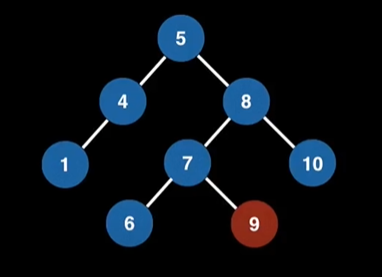
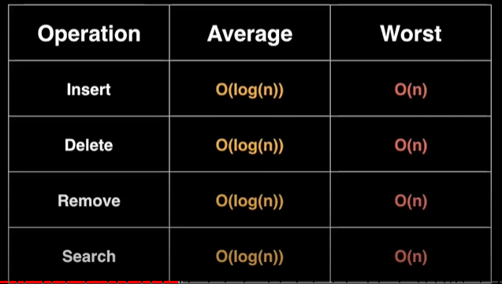

# Binary tree

- [Binary tree](#binary-tree)
  - [Discussion & example](#discussion--example)
  - [Complexity Analysis](#complexity-analysis)
  - [Implement](#implement)
- [Reference:](#reference)

## Discussion & example

+ Cây là 1 đồ thị vô hướng (undirected graph) liên thông không có chu trình.
    
+ *Tính chất*: một đồ thị nếu có 2/3 mệnh đề sau đúng thì được coi là 1 cây.
    - Đồ thị liên thông
    - Đồ thị không có chu trình
    - Số đỉnh của đồ thị lớn hơn số cạnh của đồ thị đúng 1 đơn vị.

+ **Binary tree**: là một cây mà mỗi node của nó đều có **nhiều nhất** 2 nodes con. 

+ **Binary search tree**: là một binary tree & thỏa mãn cây nhị phân bất biến.
    - node con bên trái < node con bên phải (có thể là giá trị / thứ tự alphabet)
    - *có tôn tin trật tự*: các node con/cháu < lớp bố/ông.

    

+ **When & where are Binary Trees used ?**    
    - Binary Search Trees (BSTs)
      - Implementation of some map & set ADTs 
      - Red black trees
      - AVL trees
      - Splay trees
      - etc
    - Used in the implementation of binary trees
    - Syntax trees (used by compiler & calculators)
    - Treap - a probabilistic DS (uses a randomized BST)

## Complexity Analysis

## Implement

+ Adding elements to a BST
    - Khi thêm 1 node vào tree cần so sánh nó với node cha tương lai. Có các trường hợp có thể xảy ra:
      - Recurse down left subtree
      - Recurse down right subtree
      - Handle finding a duplicate value
      - Create a new node
    - Độ phức tạp trung bình *insertion*: logarithmic nhưng worst case: O(n)

+ Removing elements from a BST:
    - Step 1: **Find** the element we wish to remove (if it exist)
    - Step 2: **Replace** the  node we want to remove with it's successor (~ con) to maintain the BST invariant.
    - *Recall*: BST invariant <=> left subtree has smaller elements & right subtree has larger elements.

+ Finding element:
    - Step 1: 

# Reference: 
[1] Data Structures Easy to Advanced Course - Full Tutorial from a Google Engineer: https://www.youtube.com/watch?v=RBSGKlAvoiM&t=6321s&ab_channel=freeCodeCamp.org