# Priority Queues and Disjoint Sets

# Contents
- [Priority Queues and Disjoint Sets](#priority-queues-and-disjoint-sets)
- [Contents](#contents)
- [Source code:](#source-code)
  - [1. Priority Queues: Introduction ](#1-priority-queues-introduction-)
  - [2. Priority Queues: Binary Heaps ](#2-priority-queues-binary-heaps-)
    - [Binary Trees](#binary-trees)
    - [Basic operations](#basic-operations)
    - [Turning Min PQ into Max PQ](#turning-min-pq-into-max-pq)
    - [Complete binary trees](#complete-binary-trees)
    - [Pseudo code](#pseudo-code)
    - [Complexity PQ with binary heap](#complexity-pq-with-binary-heap)
  - [3. Priority Queues: Heap Sort ](#3-priority-queues-heap-sort-)
    - [Heap sort](#heap-sort)
    - [Building a Heap](#building-a-heap)
    - [Final Remarks](#final-remarks)
  - [4. Disjoint Sets: Naive Implementations ](#4-disjoint-sets-naive-implementations-)
  - [5. Disjoint Sets: Efficient Implementations ](#5-disjoint-sets-efficient-implementations-)

# Source code:
[My implement](https://github.com/Doan-Nguyen/CompetitiveProgramming/tree/master/Reimplement/DataStructuresJava/src/datastructures)

## 1. Priority Queues: Introduction 

+ **Queue**: an abstract data type supporting the following main operations:
    - PushBack(e): adds an element to the back of queue
    - PopFront(): extracts an element from the front of queue

+ **Priority Queues** (Hàng đợi ưu tiên): a generalization (khái quát hóa) of a queue where each element is assigned a priority and elements come out in order by priority.

    - Example: scheduling jobs
        - process jobs one by one in order of decreasing priority
        - to add a job to the set of scheduled jobs: Insert(job)
        - to process a job with the highest priority: ExtractMax()

+ **Definition**: priority queue is an abstract data type supporting the follwing main operations:
    - Insert(p): adds a new element with priority *p*
    - ExtractMax(): extracts an element with maximum priority

+ Additional operations
    - remove(it): removes an element pointed by an iterator *it*
    - getMax(): returns an element with maximum priority (without changing the set of elements)
    - changePriority(it, p): changes the priority of an element pointed by *it* to *p*.

+ Problem: 
    - *Dijkstra's algorithm*: finding a shortest path in a graph.
    - *Prim's algorithm*: constructing a minimum spanning tree of a graph.
    - *Huffman's algorithm*: constructing an optimum prefix-free encoding of a string.
    - *Heap sort*: sorting a given sequence.
    - *Minimum Spanning Tree*: 
    - *Best First Search*
    - Anytime you need the dynamically fetch the "next best" or "next worst" element.

+ **When & where is a PQ used ?**
    - Bất kì thời điểm nào cần tới việc kết nạp có tính linh động các phần từ "next best" or "next worst"

+ **Summary**
    - Hỗ trợ việc so sánh dữ liệu. Có thể hiểu, dữ liệu đc đưa vào hàng đợi ưu tiên phải được sắp xếp theo 1 trình tự nhất định. Từ trình tự mà ta sử dụng có thể gắn mối phần tử với một độ ưu tiên.

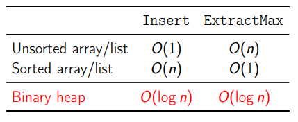

## 2. Priority Queues: Binary Heaps 

### Binary Trees
+ **Binary max-heap**: a binary tree where the value of each node is at least the values of it's children. (gia đình hơi vô phúc ~> con <= cha)

    - Example:
    
    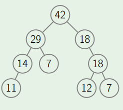

### Basic operations

+ *GetMax*: return the root value

    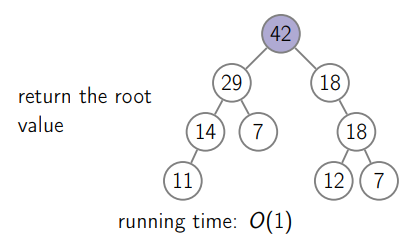

+ *Insert*:
    - attach a new node to any leaf
    - this maybe violate (break with) the heap property

    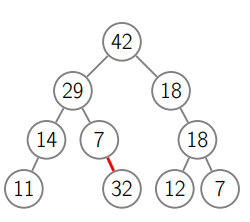

    => Solution: let the new node sift up.

+ *SiftUp*: swap the problematic node with it's parent until the property is satisfied.
    
    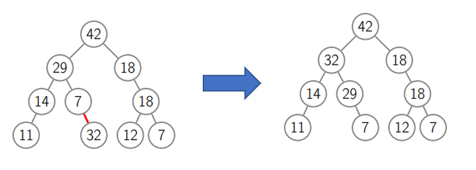

    - running time: O(tree height)

+ *ExtractMax* and *SiftDown*: 
    - Replace the root with any leaf -> maybe violate the heap property.
    => solution: *SiftDown* swap the problematic node with larger child until the heap property is satisfied.

    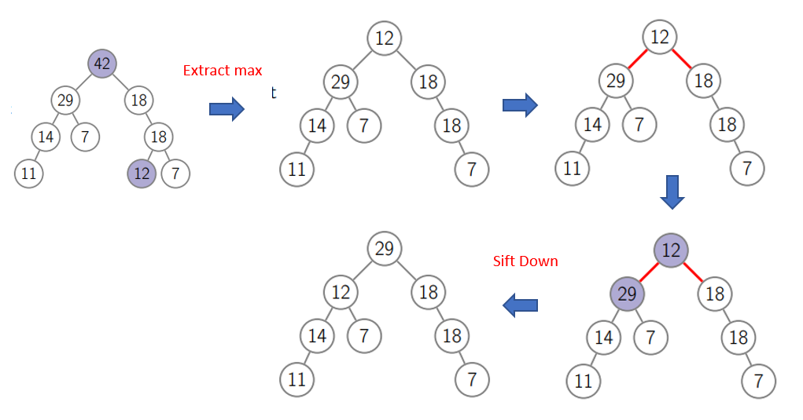

+ *ChangePriority*: change the priority and let the changed element sift up or sift down depending on whether it's priority decreased or increased.

    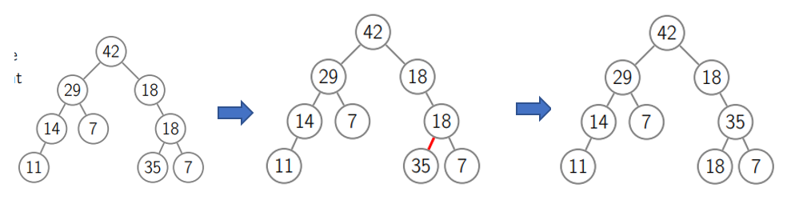

    - running time: O(tree height)

+ *Remove*: change the priority of the element to $\infty$ , let it sift up and then extract maximum.

+ **Summary**:  
  - getMax() : O(1)
  - all other operations work in O(tree_height)

### Turning Min PQ into Max PQ
+ Problem: Các thư viện thường chỉ cung cấp hàm tìm ra *min priority queues*. Nếu ta cần tìm *max priority queues* ?
    - *min priority queues*: sắp xếp phần tử có giá trị nhỏ nhất ở đầu
    => solution: invert

### Complete binary trees
+ A binary tree is *complete* if all its levels are filled except (ngoai tru) possibly the last one which is filled from left to right.
(Tất cả các levels đều đc lấp đầy hoặc ít nhất có node bên trái)

    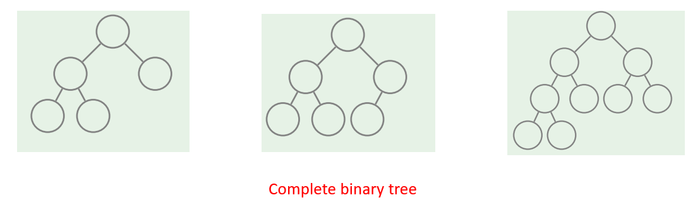

+ Otherwise

    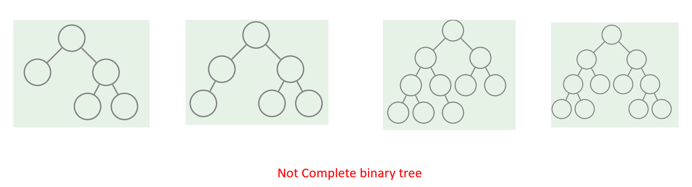

+ Advantage
  - Low height
    - Lemma (bổ đề): a complete binary tree with *n* nodes has height at most O(log n)
    - Proof:

    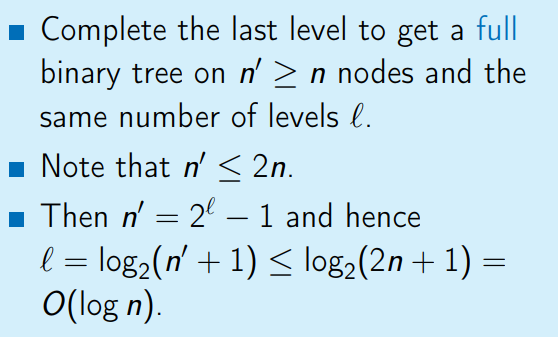

  - Store as array    
### Pseudo code
+ **General Setting**
  - *maxSize*: the maximum number of elements in the heap
  - *size*: the size of the heap
  - *H[1, ..., maxSize]*: an array of length *maxSize* where the heap occupies the first *size* elements.

+ How to find given a node *i*

    

+ To sift element *i* up
    - while element not root & it's value > its parent 's value -> swap this element with it's parent
    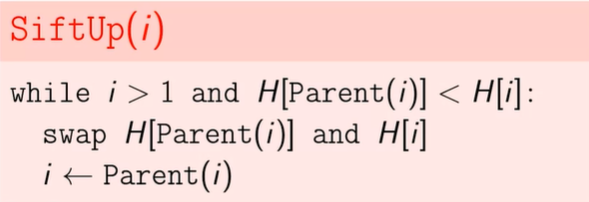

+ To sift element *i* down:
    - step 1: select the direction of sifting
      - if element <= one/two of children -> select the largest one of it's two children.
    - initially, assign maxIndex = i
    - compute the index of left child of the node number i

    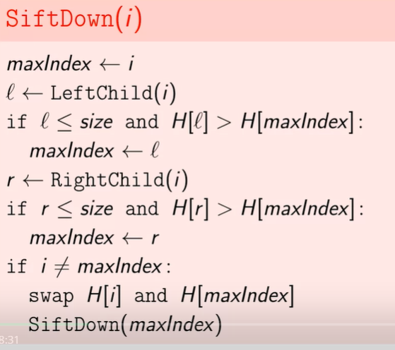

+ To insert new element with priority *p*

    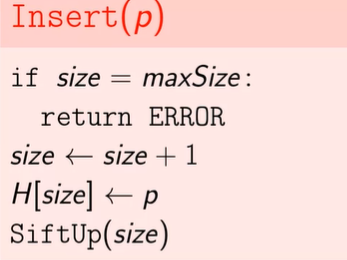

+ Extract max value from binary max heap

    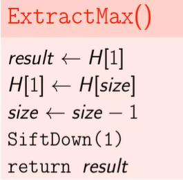

+ Remove element *i*

    

+ Change the priority of a given node *i*

    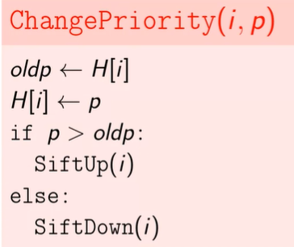

+ Summary

    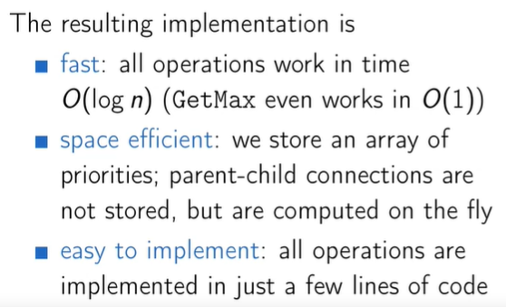

### Complexity PQ with binary heap

Binary heap construction | O(n) |
Polling | O(log(n)) |
Peeking | O(1) |
Adding | O(log(n)) |
Naive Removing | O(n) |
Advanced removing with help from a hash table * | O(log(n)) |
Naive contains | O(n) |
Contains check with help of a hash table * | O(1) |

**Note**: Using a hash table to help optimized these operations does take up linear space and also adds some overhead to the binary heap implementation.

## 3. Priority Queues: Heap Sort 

### Heap sort

+ Sort using priority queues

    - The resulting algorithm is comparison-based and has running time O(n log n) (hence, asymptotically (tiem can) optimal)

    - Natural generalization of selection sort: instead of simply scanning the rest (phan con lai) of the array to find the maximum value, use a smart data structure.

+ **Disadvantage** 
    - not in-place: uses additional space to store the priority queue

=> in order to avoid this disadvantage, we use heap sort algorithm.

+ **Idea**:
    -  Transfer array into a binary heap (by permuting (hoan vi) its elements) 
    -  Sort array:
       - Step 1: The heap property is satisfied in all the leaves
       - Step 2: Start repairing the heap property in all subtrees of depth 1
       - Step 3: With the root, the heap property is satisfied in the whole tree.
    - Running time: O(n log n)

+ Evaluate:
    - We repair the heap property going from bottom to top.
    - Initially, the heap property is satisfied in all the leaves
    - Start repairing the heap property in all subtrees of depth 1.
    - When we reach the root, the heap property is satisfied in the whole tree.

+ Advantage:
    - No need more memory
    - Worst case running: O(n log n)

+ Pseudo code:
    - Turn array into a heap:

        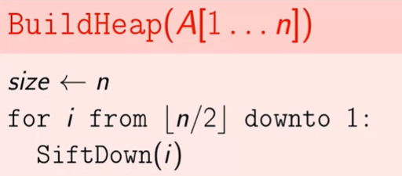

    - Sort using priority queues:

        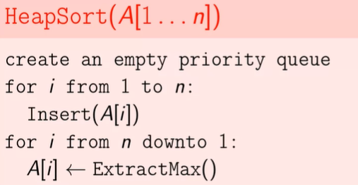

    - In-place heap sort: 

        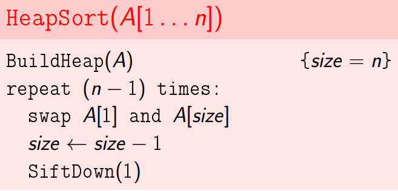

+ **In the practive**:
    - First, try quick sort. If slow (~ the recursion dips)
    - Second, try heap sort

### Building a Heap
+ The running time of BuildHeap: O(n log n)
    - SiftDown: O(n) , *n* - number of nodes
+ If a node is already close to the leaves, then sifting it down is fast.
+ 

### Final Remarks
## 4. Disjoint Sets: Naive Implementations 

## 5. Disjoint Sets: Efficient Implementations 