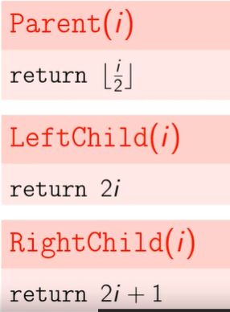
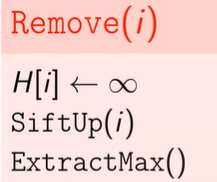

# Priority Queues and Disjoint Sets

# Contents
- [Priority Queues and Disjoint Sets](#priority-queues-and-disjoint-sets)
- [Contents](#contents)
  - [1. Priority Queues: Introduction ](#1-priority-queues-introduction-)
  - [2. Priority Queues: Heaps ](#2-priority-queues-heaps-)
    - [Binary Trees](#binary-trees)
    - [Basic operations](#basic-operations)
    - [Complete binary trees](#complete-binary-trees)
    - [Pseudo code](#pseudo-code)
  - [3. Priority Queues: Heap Sort ](#3-priority-queues-heap-sort-)
    - [Heap sort](#heap-sort)
    - [Building a Heap](#building-a-heap)
    - [Final Remarks](#final-remarks)
  - [4. Disjoint Sets: Naive Implementations ](#4-disjoint-sets-naive-implementations-)
  - [5. Disjoint Sets: Efficient Implementations ](#5-disjoint-sets-efficient-implementations-)

## 1. Priority Queues: Introduction 

+ **Queue**: an abstract data type supporting the following main operations:
    - PushBack(e): adds an element to the back of queue
    - PopFront(): extracts an element from the front of queue

+ **Priority Queues** (Hàng đợi ưu tiên): a generalization (khái quát hóa) of a queue where each element is assigned a priority and elements come out in order by priority.

    - Example: scheduling jobs
        - process jobs one by one in order of decreasing priority
        - to add a job to the set of scheduled jobs: Insert(job)
        - to process a job with the highest priority: ExtractMax()

+ **Definition**: priority queue is an abstract data type supporting the follwing main operations:
    - Insert(p): adds a new element with priority *p*
    - ExtractMax(): extracts an element with maximum priority

+ Additional operations
    - remove(it): removes an element pointed by an iterator *it*
    - getMax(): returns an element with maximum priority (without changing the set of elements)
    - changePriority(it, p): changes the priority of an element pointed by *it* to *p*.

+ Problem: 
    - *Dijkstra's algorithm*: finding a shortest path in a graph.
    - *Prim's algorithm*: constructing a minimum spanning tree of a graph.
    - *Huffman's algorithm*: constructing an optimum prefix-free encoding of a string.
    - *Heap sort*: sorting a given sequence.

+ **Naive implementations**

+ **Summary**

## 2. Priority Queues: Heaps 

### Binary Trees
+ **Binary max-heap**: a binary tree where the value of each node is at least the values of it's children. (giá trị giảm dần từ root -> leaf)

    - Example:
    
    

### Basic operations

+ *GetMax*: return the root value

    

+ *Insert*:
    - attach a new node to any leaf
    - this maybe violate (break with) the heap property

    

    => Solution: let the new node sift up.

+ *SiftUp*: swap the problematic node with it's parent until the property is satisfied.
    
    

    - running time: O(tree height)

+ *ExtractMax* and *SiftDown*: 
    - Replace the root with any leaf -> maybe violate the heap property.
    => solution: *SiftDown* swap the problematic node with larger child until the heap property is satisfied.

    

+ *ChangePriority*: change the priority and let the changed element sift up or sift down depending on whether it's priority decreased or increased.

    

    - running time: O(tree height)

+ *Remove*: change the priority of the element to $\infty$ , let it sift up and then extract maximum.

### Complete binary trees
+ A binary tree is *complete* if all its levels are filled except (ngoai tru) possibly the last one which is filled from left to right.
(Tất cả các levels đều đc lấp đầy, ngoại trừ có thể là cấp cuối cùng được điền từ trái sang phải)

    

+ Otherwise

    

+ Advantage
  - Low height
    - Lemma (bổ đề): a complete binary tree with *n* nodes has height at most O(log n)
    - Proof:

    

  - Store as array    
### Pseudo code
+ **General Setting**
  - *maxSize*: the maximum number of elements in the heap
  - *size*: the size of the heap
  - *H[1, ..., maxSize]*: an array of length *maxSize* where the heap occupies the first *size* elements.

+ How to find given a node *i*

    

+ To sift element *i* up
    - while element not root & it's value > its parent 's value -> swap this element with it's parent
    

+ To sift element *i* down:
    - step 1: select the direction of sifting
      - if element <= one/two of children -> select the largest one of it's two children.
    - initially, assign maxIndex = i
    - compute the index of left child of the node number i

    

+ To insert new element with priority *p*

    

+ Extract max value from binary max heap

    

+ Remove element *i*

    

+ Change the priority of a given node *i*

    

+ Summary

    

## 3. Priority Queues: Heap Sort 

### Heap sort

+ Sort using priority queues

    - The resulting algorithm is comparison-based and has running time O(n log n) (hence, asymptotically (tiem can) optimal)

    - Natural generalization of selection sort: instead of simply scanning the rest (phan con lai) of the array to find the maximum value, use a smart data structure.

+ **Disadvantage** 
    - not in-place: uses additional space to store the priority queue

=> in order to avoid this disadvantage, we use heap sort algorithm.

+ **Idea**:
    -  Transfer array into a binary heap (by permuting (hoan vi) its elements) 
    -  Sort array:
       - Step 1: The heap property is satisfied in all the leaves
       - Step 2: Start repairing the heap property in all subtrees of depth 1
       - Step 3: With the root, the heap property is satisfied in the whole tree.
    - Running time: O(n log n)
+ Pseudo code:
    - Turn array into a heap:

        

    - In-place heap sort:

        

+ Advantage:
    - No need more memory
    - Worst case running: O(n log n)

### Building a Heap

### Final Remarks
## 4. Disjoint Sets: Naive Implementations 

## 5. Disjoint Sets: Efficient Implementations 