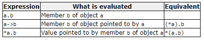

# Tổng hợp các notes về C++
## 1. C++ Overview
+ Definition: C++ is a statically typed, compiled, general-purpose, case-sensitive, free-form programming language that support procedural, object-oriented and generic programming.
    - Statically typed (định kiểu dữ liệu tĩnh): ngôn ngữ lập trình xác định các kiểu dữ liệu vào thời điểm dịch.
    - Biên dịch (complied): ngôn ngữ phải qua một bộ dịch (complier) trước khi trở thành chương trình mà hệ điều hành có thể đọc được.
    - General-purpose (đa chức năng)
    - Free-form (đa hình): 
    - Case-sensitive 
    - Procedual programming (lập trình thủ tục): chương trình xử lý các thủ tục từ trên xuống dưới.
    - Object oriented programming: object include data + method.
    - Generic programming: khả năng lập trình cho phép đặt các kiểu dữ liệu sẽ được xác định về sau trong thuật toán.

+ Standard libraries
    - The core language: all the building blocks including variables, data types & literal
    - The C++ Standard library (std): set of functions manipulating files, strings ...
    - The Standard Template Library (STL): set of method manipulating data structures (set, vector, map)...

## 2. C++ Basic
### 2.1 Overview 
+ C++ program can be defined as a collection of objects that communicate via invoking each other's methods.
    - Object: have states & behaviors.
    - Class: define the behaviors and states of objects
    - Methods
    - Instance variables

### 2.2 Compound data types
#### 2.2.1 Array
+ An array is a series of elements of the same type placed in contigous memory locations that can be individually rereferenced by adding an index to a unique identifier.
+ A typical declaration:
    ```
    type name [elements];
    ```
    - **Note**:
        - The elements field within [], representing the number of elements in the array, *must be* a constant expression. The array's size must be determined at compile time before the program runs.

+ Initializing array:
        ```
        type_data array_name[n] = {elem_1, elem_2, ..., elem_n};
        ```
    - If declare the number of elements less than n, the remaining elements are set to default values (0).
        - Example: int arr[5] = {1, 2, 3}; # arr[4] = 0, arr[5] = 0
    - If not declare n, the compiler will assume automatically a size for the array that matches the number of values included between {}
        - Example: int arr[] = {1, 2, 3, 4, 5};
    - Initialize an array multiples-dimension:
        ```
        type_dat array_name[dimension_1][dimension_2];
        ```
+ Accessing the values of an array:
    - with an array 1-dimension:
        ```
        arr_name[index];
        ```
    - With an array 2-dimension:        
        ```
        array_name[row_indx][col_indx];
        ```
+ Arrays as parameters
    - To pass an array to a function as a parameter:
        - C++ can not pass the entire block of memory represented by an array to a function directly as an argument.
        - C++ can pass the array's address.
    - To accept an array as parameter for a function:
        - the parameter can be declared as the array type but with empty brackets.
        - Example: 
        ```
        void procedure(int arg[]){
            // do some thing
        }
        
        int main(){
            int arr[40];
            procedure(arr);
        }
        ``` 
        - With a multi-dimensional array as argument:
        ```
        base_type[][depth][depth]
        ```
+ Library arrays
    - C++ provides an alternative array type as a standard container.
    - Example:
    ```
    #include <iostream>
    #include <array>

    int main(){
        array<int, 3> arr {1, 2, 3};
        for (int i=0; i < arr.size(); i++){
            ++arr[i];
        }
        return 0;
    }
    ```

#### 2.2.2 Character sequences (String)
+ A string (sequences of characters) can represent them also as arrays of elements of a character type.
+ Consider an example:
    ```
    char foo [20];
    ```
    - this array have a capacity to store sequences of up to 20 characters.
    - the end of strings represented in character sequences is signaled by a special character: *null character*  - '\0'

+ **Initialization** of null-terminated character sequences
    - To initialize an array of characters with som predetermined sequence of characters:
        ```
        char predet_char = {"O", "l", "l", "e", "h", "\0"};
        ```
    - Another way to initialized: using *string literals* directly
        ```
        char predet_char = "Olleh";
        ```
    - In both cases, the array of *predet_char* is declared with a size of 6 elements of type char.
    - **Note**: i initialized an array of characters and not assign values to them.

#### 2.2.3 Structure
+ Data structures
    - A group of data elements (*members*) grouped together under one name.
    - The members can have different types & different lengths.
    - Syntax:
        ```
        struct type_name{
            member_type1 member_name1;
            member_type2 member_name2;
            ...
        } object_names;
        ```

        - *type_name*: name for the structure type
        - *object_names*: a set of valid identifies for objects that have type of this structure.
    - Example:
        ```
        //          Declaration create a new type data
        struct product{
            int weight;
            double price;
        }
        //         Use product to declare an object (apple)
        product apple;
        //         Access directly structure type's members
        apple.weight
        apple.price
        ```
+ Pointers to structures
    - structures can be pointed to by its own type of pointers.
    - Example:
        ```
        struct movies_t{
            string title;
            int year;
        }
        //
        movie_t my_movie;
        movie_t* your_movie;
        ```

        - *my_movie*: an object of structure type *movies_t*
        - *your_movie*: a pointer to point to object of structure type *movies_t*

        ```
        your_movie = &my_movie;
        your_movie->title;
        your_movie->year;
        ```
        - the value of pointer *your_movie* would be assigned the address of object *my_movie*
        - the arrow operator (->): a dereference (tham chieu) operator that is used exclusively (only) with pointers to object that have members.
        - This operator serves to access the member of an object directly from its address.

        

+ Nesting (combine) structures
    - Structures can also be nested in such a way that an element of a structure is itself another structure:
    ```
    struct movies_t{
        string title;
        int year;
    };
    //
    struct persons{
        string name;
        string email;
        movies_t favorite_movie;
    }
    //
    persons doannn;
    //
    persons* new_person = &doannn;
    ```
    - After the previous declarations, 
    ```
    doannn.name
    doannn.favorite_movie.title;
    new_person->favorite_movie.year
    ```

#### 2.2.4 Pointers
+ The variable can be accessed by:
    - identifier (name)
    - location

+ Address-of operator (&) 
    - The address of a variable can be obtained by preceding the name of a variable with '&' - *address-of operator*:
    ```
    var_add = &var;
    ```
        - assign the address of variable *var* to *var_add*.

+ Dereference operator (*)

+ Declaring pointers 

+ Pointers and arrays

+ Pointer initialization

+ Pointer arithmetics

+ Pointers & cost

+ Pointers and string literals

+ Pointers to pointers

+ Void pointers

+ Invalid pointers and null pointers
# Reference:
[1] https://www.cplusplus.com/doc/tutorial/
[2] https://xlinux.nist.gov/dads
[3] https://cis.stvincent.edu/html/tutorials/swd/index.html