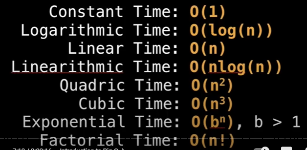
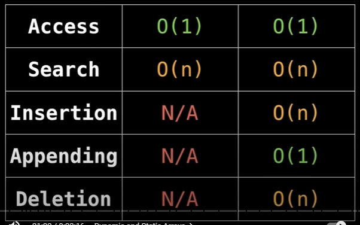
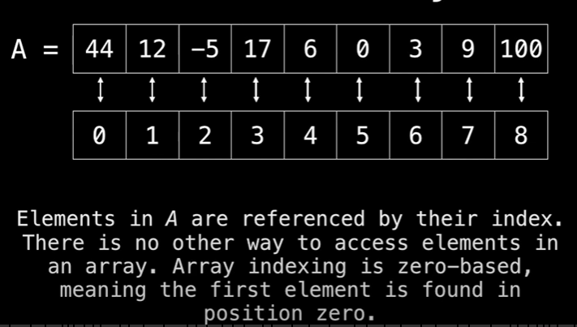
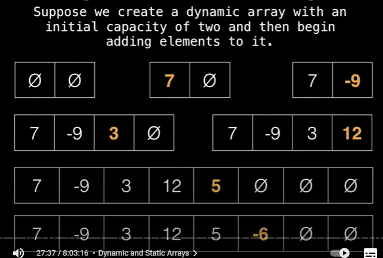
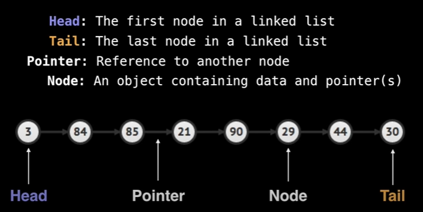

# Contents

- [Contents](#contents)
- [Data Structures Easy to Advanced](#data-structures-easy-to-advanced)
  - [Introduction to Big-O](#introduction-to-big-o)
    - [Computational complexity analysis](#computational-complexity-analysis)
  - [Dynamic & static array](#dynamic--static-array)
  - [Linked List`](#linked-list)
  - [Stack](#stack)
  - [Queue](#queue)
  - [Priority queue](#priority-queue)
  - [Union Find](#union-find)
  - [Binary Search Tree](#binary-search-tree)
  - [Hash Table](#hash-table)

# Data Structures Easy to Advanced

## Introduction to Big-O

+ Big-O notation gives an upper bound of the complexity in the **worst** case, helping to quantify performance as the input size becomes *arbitrarily large*.

### Computational complexity analysis
+ Two questions:
    - How much *time* dose this algorithm need to finish ?
    - How much *space* does this algorithm need to computation ?

+ Complexities ordered in from smallest to largest

    

+ Big-O properties

    - O(n + c) = O(n)
    - O(cn) = O(n), c > 0
    - f(n) = 7log(n^3) + 12log(n) => O(f(n)) = O(n^3)

## Dynamic & static array

+ What is an Array ?
    - A static array is a fixed length container containing *n* elements. Index in range [0, n - 1].
    
+ When & where is a array used ?
    - Storing & accessing sequential data
    - Temporarily storing objects
    - Used by IO routines as buffers
    - Lookup tables and inverse lookup tables
    - Can be used to return multiple values from a function
    - Used in dynamic programming to cache answers to sub-problems.

+ Complexity

    

    - **Static array:**
    
        

    - **Dynamic Array:** The dynamic array can **grow** (add()) and **shrink** (remove()) in size.
        - We can implement a dynamic array by using a static array:
            - Step 1: create a static array with an initial capacity
            - Step 2: add elements to the underlying static array, keeping track of the number of elements
            - Step 3: if adding another element will exceed the capacity, then create a new static array with twice the capacity & copy the original elements into it.

        

## Linked List`

+ What is a linked list ?
    - A linked list is a sequential list of nodes that hold data which point to other nodes also containing data.

+ Where are linked list used ?
    - Used in many list, Queue & Stack implementations
    - Great for creating circular lists.
    - Can easily model real world objects such as trains
    - Used in separate chaining which is present certain Hashtable implementations to deal with hashing collisions.
    - Often used in the implementation of adjacency lists for graphs.

+ Terminology
    - Head: The first node 
    - Tail: the last node
    - Pointer: Reference to another node
    - Node: an object containing data & pointers

    

+ Singly vs Doubly linked list
    
    Propeties | Singly Linked Lists | Doubly Linked Lists |
    --------- | ------------------- | ------------------- |
    Definition | Only hold a reference to the next node | Each node holds a reference to the next & previous node |
    Pros | - Uses less memory & Simpler implementation| Can be traversed back |
    Cons | Cannot easily access previous elements | Takes 2x memory |
## Stack

## Queue

## Priority queue

## Union Find

## Binary Search Tree

## Hash Table

